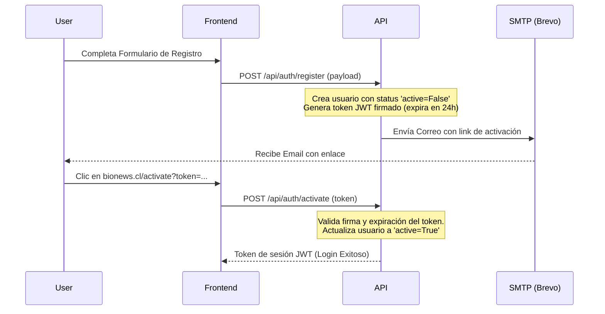

# BioNews — Plan Técnico de Continuidad y Entrega (Handover)

Este documento sirve como guía técnica detallada para que cualquier desarrollador o Agente de IA continúe con la implementación de nuevas características de la plataforma **BioNews**.

---

## 1. 📬 Registro por Email y Recuperación de Contraseña (Gratuito)

Para mantener los costos en $0 USD inicialmente, se estructurará el flujo con un servicio de correo con capa gratuita generosa y autenticación segura.

### Componentes Sugeridos
1.  **Proveedor SMTP Gratuito:** **Brevo (anteriormente Sendinblue)** ofrece hasta 300 correos diarios totalmente gratis, o **Mailjet** con 200 correos diarios. Ambos tienen SDK de Python y servidores SMTP estándar muy fáciles de configurar.
2.  **Librería de Criptografía:** `itsdangerous` o `python-jose` (ya instalada en el proyecto) para crear tokens de confirmación firmados con expiración corta.

### Flujo de Registro con Confirmación


### Flujo de Cambio de Contraseña (Recuperación)
1.  **Solicitud:** El usuario ingresa su correo en `/api/auth/forgot-password`.
2.  **Validación y Envío:** Si el correo existe, el backend genera un token de seguridad de corta duración (ej: 15 minutos) que incluye el ID de usuario. Se envía un enlace al correo: `bionews.cl/reset-password?token=XYZ`.
3.  **Restablecimiento:** El usuario accede al formulario, ingresa la nueva contraseña y el frontend hace un `POST /api/auth/reset-password` enviando el token y la nueva contraseña. El backend valida el token, cifra la contraseña con `bcrypt` y actualiza la base de datos.

---

## 2. 📰 Newsletter Diario por Email (Gratuito)

El objetivo es enviar de forma automática un boletín diario consolidado con los registros cargados en las últimas 24 horas.

### Lógica de Selección de Registros (Query SQL)
El envío se programa a una hora fija (ej: 11:30 AM). La consulta debe buscar todos los registros que tengan un `fecha_scraping` mayor al momento del envío del día anterior.

```sql
-- Obtiene noticias y registros de las últimas 24 horas
SELECT titulo, fuente, fecha_scraping, link
FROM scrapers.noticias
WHERE fecha_scraping >= NOW() - INTERVAL '24 hours'
ORDER BY fecha_scraping DESC;
```

### Automatización (Cron/Scheduler)
Dado que consolidamos el scheduler en `scheduler.py`, añadiremos una tarea diaria utilizando la biblioteca `schedule`:
```python
def enviar_newsletter_diario():
    # 1. Consultar registros nuevos de las últimas 24 horas en las tablas clave
    # 2. Generar plantilla HTML responsive con los datos consolidados
    # 3. Consultar usuarios suscritos al boletín: SELECT email FROM users WHERE newsletter_subscribed = 1
    # 4. Enviar emails en hilos o en background para no saturar
    pass

schedule.every().day.at("11:30").do(enviar_newsletter_diario)
```

### Diseño del Email (Plantilla HTML Responsiva)
Para que el correo luzca sumamente profesional, se recomienda usar una estructura CSS en línea (inline style) apta para clientes de correo móviles y de escritorio.

```html
<!DOCTYPE html>
<html>
<head>
  <meta charset="utf-8">
  <meta name="viewport" content="width=device-width, initial-scale=1.0">
  <style>
    body { font-family: 'Segoe UI', Arial, sans-serif; background-color: #f4f6f8; margin: 0; padding: 20px; }
    .card { background: #ffffff; border-radius: 8px; padding: 20px; margin-bottom: 15px; border-left: 4px solid #10b981; box-shadow: 0 2px 4px rgba(0,0,0,0.05); }
    .title { color: #1f2937; font-size: 16px; font-weight: bold; text-decoration: none; }
    .meta { color: #6b7280; font-size: 12px; margin-top: 5px; }
  </style>
</head>
<body>
  <div style="max-width: 600px; margin: 0 auto;">
    <h2 style="color: #065f46;">🌱 Resumen Diario BioNews</h2>
    <p style="color: #4b5563;">Aquí tienes las novedades ambientales procesadas en las últimas 24 horas:</p>
    
    <!-- Iterar sobre los registros -->
    <div class="card">
      <a href="URL_DEL_REGISTRO" class="title">Modificación de proyecto SEIA: Parque Solar Atacama</a>
      <div class="meta">Fuente: SEA - Hace 3 horas</div>
    </div>
    
    <hr style="border: 0; border-top: 1px solid #e5e7eb; margin: 20px 0;">
    <p style="font-size: 11px; color: #9ca3af; text-align: center;">
      Recibes este correo porque estás suscrito a BioNews. <a href="UNSUBSCRIBE_URL" style="color: #10b981;">Dar de baja</a>
    </p>
  </div>
</body>
</html>
```

---

## 3. 📱 Aplicación Móvil Android (Estrategia Bidireccional)

### Opción A: Contenedor Web Híbrido (CapacitorJS / PWA) – *Recomendado por velocidad y costos*
Consiste en empaquetar la aplicación web actual (React + TypeScript) para que corra como una app nativa Android utilizando una vista web de alto rendimiento.

*   **Tecnología:** **CapacitorJS** (desarrollado por el equipo de Ionic).
*   **Workflow:**
    1.  Agregar Capacitor al proyecto React existente: `npm install @capacitor/core @capacitor/cli`.
    2.  Inicializar el proyecto: `npx cap init BioNews com.bionews.app`.
    3.  Añadir la plataforma Android: `npm install @capacitor/android` y luego `npx cap add android`.
    4.  Generar el build de producción de React (`npm run build`).
    5.  Sincronizar el build con la carpeta de Android: `npx cap sync`.
    6.  Abrir Android Studio (`npx cap open android`) y compilar el archivo `.apk` o `.aab` listo para Google Play Store.
*   **Ventajas:**
    - Reutiliza el 100% de la interfaz CSS, DataGrids y lógica de MUI actual.
    - Se compila en 2 horas de trabajo.
    - Los cambios en la web se pueden ver reflejados de inmediato.

---

### Opción B: Aplicación Nativa Dedicada (Nueva Interfaz)
Diseño de una aplicación móvil nativa desde cero que consuma la API de FastAPI a través de llamadas JSON REST.

*   **Tecnología:** **Flutter** (Dart) o **React Native** (TSX). Se prefiere Flutter por la fluidez de sus widgets y su rendimiento nativo excelente en Android.
*   **Workflow de Desarrollo:**
    1.  **Diseño UI/UX:** Crear pantallas móviles específicas de Dashboard, Lista de Registros, Detalle del Proyecto y Alertas en Figma (adaptados a proporciones móviles nativas 18:9).
    2.  **Cliente API:** Implementar un cliente HTTP en Flutter/React Native con persistencia local de tokens JWT (usando `flutter_secure_storage`).
    3.  **Lector de SSE:** Adaptar la lógica de SSE (Server-Sent Events) en el móvil para capturar y pintar notificaciones nativas en segundo plano.
    4.  **Despliegue:** Compilar y firmar el APK en producción.
*   **Ventajas:**
    - Interfaz 100% optimizada para pulgares y gestos móviles.
    - Notificaciones push nativas del sistema operativo mediante Firebase Cloud Messaging (FCM).
    - Rendimiento gráfico impecable en dispositivos antiguos.

---

## 4. 💾 Estrategia de Backups de Base de Datos

Garantizar la resiliencia de la base de datos de producción (PostgreSQL 16) ante pérdidas de datos accidentales.

### Plan de Backup Automatizado (Script de 3 Etapas)
1.  **Generación del Dump:** Usar `pg_dump` para realizar un volcado comprimido de la base de datos sin detener los servicios.
2.  **Rotación de Archivos:** Conservar copias diarias durante 7 días, semanales por 4 semanas y mensuales por 12 meses.
3.  **Almacenamiento en Nube Gratuito:** Utilizar **rclone** configurado con una cuenta gratuita de Google Drive o un bucket con capa gratuita de Cloudflare R2 (10 GB gratis al mes, sin cargos de egreso).

### Script de Respaldo (`backup.sh`)
```bash
#!/bin/bash
# Variables
DB_NAME="bionews"
DB_USER="bionews"
BACKUP_DIR="/var/backups/bionews"
DATE=$(date +%Y-%m-%d_%H%M%S)
FILENAME="${BACKUP_DIR}/bionews_backup_${DATE}.sql.gz"

# Crear directorio si no existe
mkdir -p ${BACKUP_DIR}

# Ejecutar el respaldo comprimido de Postgres
docker exec -t bionews-db pg_dump -U ${DB_USER} -d ${DB_NAME} | gzip > ${FILENAME}

# Rotar archivos antiguos (borrar archivos locales con más de 7 días)
find ${BACKUP_DIR} -type f -mtime +7 -name "*.sql.gz" -exec rm {} \;

# Opcional: Subir a la nube de Google Drive usando rclone
# rclone copy ${FILENAME} gdrive:BioNewsBackups/
```
*Programar este script en el `crontab` de Linux de producción para que se ejecute todas las noches a las 03:00 AM.*

---

## 5. 💳 Pasarelas y Monetización SaaS (Chile / LATAM)

Ideas comerciales y técnicas para cobrar a los clientes corporativos y usuarios de BioNews.

### 1. Pasarelas de Pago Recomendadas
*   **Stripe (Recomendado):** Ya opera oficialmente en Chile. Su API es la mejor del mundo para suscripciones recurrentes, reintentos automáticos de tarjetas rechazadas, y tiene un portal de clientes autogestionable (donde el usuario puede actualizar su tarjeta o cancelar el plan sin que tengas que programar nada de eso). Permite cobrar en Pesos Chilenos (CLP) o Dólares (USD).
*   **Flow.cl:** Ideal si tus clientes exigen pagar de forma local con **Webpay Plus (Redcompra)**, transferencias bancarias directas, o Servipag. Ofrece cobros por suscripción recurrente en pesos y UF.
*   **Mercado Pago:** Muy buena opción para cobros en Chile. Ofrece SDK robusto de Python y alta aceptación de tarjetas locales.

### 2. Estructura de Planes de Suscripción
*   **Plan Básico (Gratuito / Freemium):**
    - Acceso a las noticias generales de fuentes ambientales.
    - Notificaciones tardías (24 horas).
*   **Plan Profesional (Pago Mensual / Suscripción):**
    - Acceso en tiempo real a las causas judiciales y notificaciones SSE automáticas.
    - Buscador avanzado con Trigramas (pg_trgm) habilitado.
    - Configuración ilimitada de preferencias y "puntos rojos" cruzados.
*   **Plan Enterprise / Corporativo (Pago Anual o por Volumen):**
    - Reportes PDF automatizados.
    - Soporte multiusuario (cuentas de equipo para una misma consultora).
    - Descarga de históricos en formato Excel/CSV.

---

## 6. 🚀 Recomendaciones Generales para el Crecimiento del SaaS

1.  **Aislamiento y Costos del Servidor:** Actualmente, una máquina VPS básica de 10 USD/mes en **Hetzner** o **DigitalOcean** con 2 GB de RAM es más que suficiente para correr Postgres 16, Redis y la API FastAPI sin problemas.
2.  **Monitoreo de Caídas Gratuito:** Configura **UptimeRobot** (gratuito) apuntando al endpoint `/api/health`. Si el contenedor de la API o el servidor se cae, te enviará un correo o alerta de inmediato.
3.  **Seguridad de Endpoints:** Antes de lanzar a producción comercial, cambia la política de CORS de `"*"` a tus orígenes exactos en [server.py](file:///c:/Users/maria/Desktop/BioNews/server.py), y aplica un límite estricto de intentos de registro e inicio de sesión para mitigar ataques de fuerza bruta.
