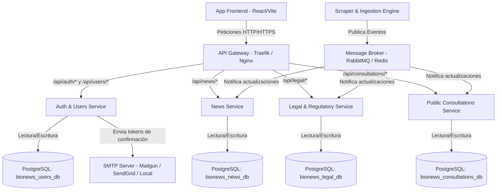
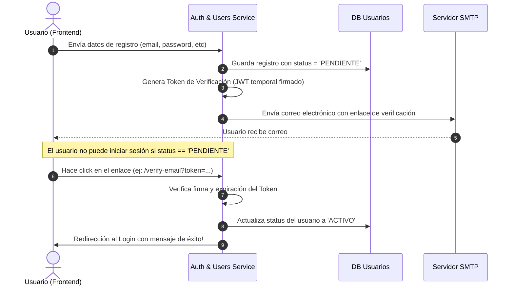

# Plan Maestro: Transición a Microservicios y Base de Datos PostgreSQL

Este documento presenta una propuesta detallada y paso a paso para la evolución arquitectónica de BioNews: migrando de la base de datos SQLite actual a un clúster PostgreSQL en contenedores de Docker, dividiendo el sistema en microservicios independientes (con bases de datos desacopladas) y refactorizando el flujo de autenticación para implementar verificación de Email.

---

## 1. Arquitectura de Microservicios Propuesta

Para garantizar escalabilidad, aislamiento de fallos y un desarrollo modular, proponemos dividir el backend monolítico en los siguientes **microservicios autónomos**:



### Detalle de cada Componente:

1. **API Gateway (Puerta de enlace)**
   - **Función:** Único punto de entrada para el frontend. Enruta el tráfico, valida tokens JWT de forma centralizada y aplica límites de tasa (rate limiting).
   - **Tecnología recomendada:** _Traefik_ (excelente integración con Docker) o _Nginx_.

2. **Servicio de Autenticación y Usuarios (Auth & Users Service)**
   - **Responsabilidad:** Registro, autenticación, flujo de tokens JWT, perfiles de usuario, preferencias y favoritos.
   - **Almacén de Datos:** Base de datos independiente `bionews_users_db`.

3. **Servicio de Noticias (News Service)**
   - **Responsabilidad:** Gestión de fuentes de medios, noticias generales parseadas y feeds activos.
   - **Almacén de Datos:** Base de datos independiente `bionews_news_db`.

4. **Servicio Legal y Regulatorio (Legal & Regulatory Service)**
   - **Responsabilidad:** Gestión de todo el volumen masivo de datos de SMA (Fiscalizaciones, Sanciones, Programas de Cumplimiento, Medidas Provisionales, Requerimientos), SEA (Proyectos Evaluados, Pertinencias) y Normativas Generales.
   - **Almacén de Datos:** Base de datos independiente `bionews_legal_db`.

5. **Servicio de Consultas Públicas (Public Consultations Service)**
   - **Responsabilidad:** Consultas y participación ciudadana del Ministerio de Salud (MINSAL), Ministerio del Medio Ambiente (MMA) y Dirección General de Aguas (DGA).
   - **Almacén de Datos:** Base de datos independiente `bionews_consultations_db`.

6. **Motor de Scraping e Ingesta (Scraper Engine)**
   - **Responsabilidad:** Tareas de crawling y scraping en segundo plano de las distintas fuentes externas.
   - **Funcionamiento:** Se desacopla completamente del servidor web principal. Corre de manera programada (Celery o APScheduler) y, en lugar de escribir directo en la base de datos de los otros servicios, se comunica de manera **asíncrona** publicando eventos en un Message Broker (_RabbitMQ_ o _Redis_) o invocando endpoints internos y protegidos de los respectivos microservicios (`news`, `legal`, `consultations`).

---

## 2. Migración a PostgreSQL con Docker (Laptop Servidor)

Para correr bases de datos distribuidas y microservicios en un único servidor local (laptop servidor de producción), la herramienta perfecta es **Docker Compose**.

### Estrategia de Inicialización de PostgreSQL

En lugar de levantar un contenedor Docker para cada microservicio (lo cual consumiría excesiva RAM en la laptop servidor), se recomienda **levantar un único contenedor de PostgreSQL** y crear múltiples bases de datos lógicas independientes dentro de él.

#### Ejemplo de `docker-compose.yml` para Producción:

```yaml
version: "3.8"

services:
  postgres_db:
    image: postgres:15-alpine
    container_name: bionews_postgres
    restart: always
    environment:
      POSTGRES_USER: bionews_admin
      POSTGRES_PASSWORD: secret_master_password
      POSTGRES_MULTIPLE_DATABASES: bionews_users_db,bionews_news_db,bionews_legal_db,bionews_consultations_db
    volumes:
      - postgres_data:/var/lib/postgresql/data
      - ./init-multiple-databases.sh:/docker-entrypoint-initdb.d/init-multiple-databases.sh
    ports:
      - "5432:5432"

  redis_broker:
    image: redis:7-alpine
    container_name: bionews_redis
    restart: always
    ports:
      - "6379:6379"

volumes:
  postgres_data:
    driver: local
```

> [!NOTE]
> El script `init-multiple-databases.sh` es un shell script estándar que se monta en el directorio de entrada de PostgreSQL para crear automáticamente las 4 bases de datos al arrancar el contenedor por primera vez.

### Estrategia de Migración de SQLite a PostgreSQL

1. **Extracción y Mapeo:** Usar un ORM en Python (como SQLAlchemy o SQLModel) que soporte múltiples dialectos.
2. **Script de Migración (Scripted ETL):**
   - Escribir un script temporal en Python que lea los datos de la base de datos SQLite actual.
   - Realice las transformaciones de tipos de datos necesarias (por ejemplo, SQLite almacena fechas como textos, PostgreSQL requiere tipos reales `TIMESTAMP` o `DATE`).
   - Escriba los datos en las bases de datos lógicas de PostgreSQL recién creadas a través de los correspondientes microservicios o cargándolos directamente a los esquemas con SQLAlchemy.
3. **Validación:** Validar que la integridad referencial y los índices se hayan recreado correctamente.

---

## 3. Refactorización del Sistema de Autenticación con Confirmación de Email

Para profesionalizar el flujo de usuarios y asegurar que no haya registros basura, implementaremos un flujo de verificación de correo electrónico.

### Flujo de Trabajo (Workflow):



### Componentes de Implementación:

1. **Estado del Usuario (`status`):**
   - Se añade una columna `status` a la tabla `users` con tipo ENUM (`PENDIENTE`, `ACTIVO`, `BLOQUEADO`).
2. **Generación del Token:**
   - Usar un token JWT firmado criptográficamente con la clave secreta del servidor.
   - Payload sugerido: `{"sub": user_id, "email": user_email, "exp": expiration_time}` (por ejemplo, 24 horas de expiración).
3. **Servicio de Envío de Correos:**
   - Integrar un cliente SMTP ligero en el **Auth Service**. Se puede conectar de forma segura a proveedores como Mailgun, SendGrid o AWS SES.
   - En desarrollo se puede usar una herramienta como **Mailpit** o **Mailhog** para interceptar y testear los correos sin enviarlos realmente.

---

## 4. Gestión de Favoritos en Arquitectura de Microservicios

Uno de los principales retos al separar las bases de datos es cómo enlazar los favoritos.

### ¿Cómo se implementa?

En el **Servicio de Autenticación y Usuarios**, la tabla de favoritos (`favorites`) se estructurará con los siguientes campos:

- `id` (Clave primaria)
- `user_id` (Clave foránea que apunta al usuario)
- `resource_id` (ID único o link del registro original, por ejemplo, "R-157-2026")
- `fuente` (Indica a qué microservicio o categoría pertenece: `SEA`, `SMA`, `Normativas`, `Noticias`, `Consultas`)
- `nombre` (Copia estática del título/nombre para renderizado rápido sin llamadas cruzadas)
- `url_accion` (Enlace de acción rápida para descargar documentos)

### Flujo de Consulta:

- Cuando el frontend solicita los favoritos del usuario:
  - Hace una petición a `/api/users/favorites`.
  - El **Auth & Users Service** lee los favoritos de la base de datos `bionews_users_db` y los retorna de inmediato al cliente.
  - Esto evita tener que hacer complejas consultas cruzadas (_joins_ en base de datos) entre diferentes servidores físicos, manteniendo un excelente rendimiento.

---

## 5. Próximos Pasos para la Implementación (Hoja de Ruta)

Para llevar a cabo este plan sin causar disrupción en el servicio actual, se sugiere el siguiente orden cronológico:

1. **Paso 1: Configurar Docker y Postgres en la Laptop Servidor**
   - Instalar Docker y arrancar el contenedor PostgreSQL con las 4 bases de datos lógicas.
2. **Paso 2: Desarrollar el Script de Migración de Datos**
   - Migrar toda la información histórica actual desde SQLite a PostgreSQL.
3. **Paso 3: Extraer el "Auth & Users Service"**
   - Implementar el flujo de confirmación de email y separar esta base de datos.
4. **Paso 4: Separar gradualmente los servicios de Datos**
   - Migrar primero Consultas públicas, luego Noticias y finalmente el módulo Legal.
5. **Paso 5: Desacoplar el Scraper Engine**
   - Convertir los scrapers en workers independientes que publiquen datos en la API de forma segura.
