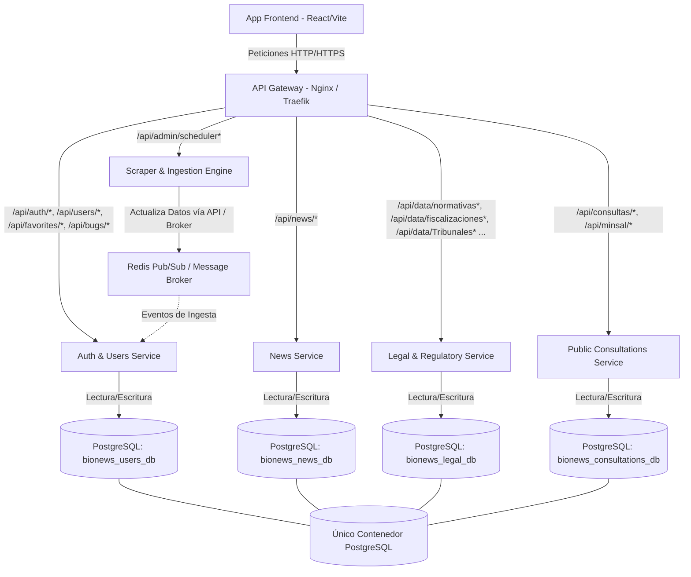
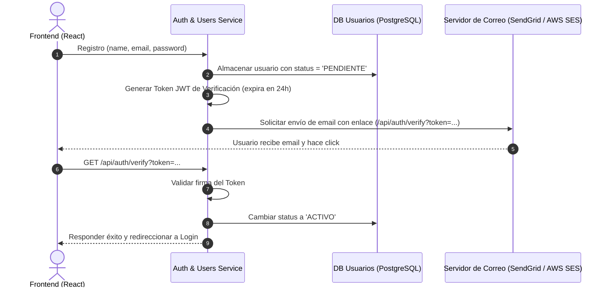
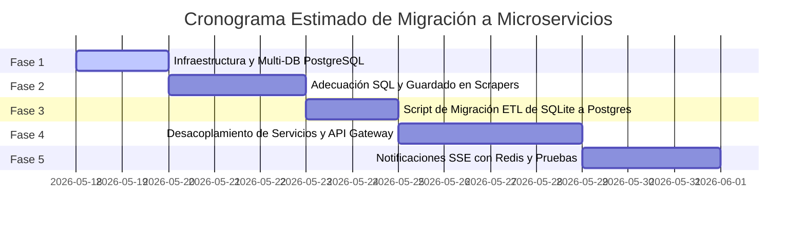

# Plan de Implementación: Migración a Microservicios y PostgreSQL (BioNews)

Este plan de implementación detalla la estrategia técnica para la transición evolutiva de **BioNews** de una arquitectura monolítica con base de datos SQLite a un sistema desacoplado de microservicios con bases de datos PostgreSQL independientes, orquestadas mediante Docker Compose y un API Gateway centralizado.

> [!IMPORTANT]
> **Lineamientos Clave:**
>
> 1. **Modificaciones permitidas en scrapers:** Se permite modificar la forma de guardado y conexión a base de datos en los scrapers (cambio de dialecto SQLite a PostgreSQL, placeholders, cláusulas de conflicto, etc.).
> 2. **Lógica de extracción intocable:** La lógica de navegación, crawling, parsing (Playwright, BeautifulSoup) y procesamiento de datos no sufrirá ningún cambio.
> 3. **Autenticación con correo electrónico pospuesta:** Se detalla en una fase posterior para desarrollo futuro.
> 4. **Arquitectura no destructiva:** Se preserva el funcionamiento actual durante todo el proceso de transición mediante fases iterativas.

---

## 1. Arquitectura de Microservicios Propuesta

Para garantizar escalabilidad, aislamiento de fallos y un desarrollo modular, proponemos dividir el backend monolítico en los siguientes **microservicios autónomos**:



---

## 2. Plan por Fases de la Migración

### Fase 1: Infraestructura de Datos (Docker & PostgreSQL)

En lugar de levantar múltiples contenedores de PostgreSQL que consumirían excesivos recursos de RAM en la laptop servidor, se levantará un **único contenedor de PostgreSQL** que albergará las 4 bases de datos lógicas independientes.

#### 1. Configuración de Inicialización

Se montará el script `init-multiple-databases.sh` en el directorio de entrada del contenedor PostgreSQL para crear automáticamente las bases de datos requeridas al arrancar:

```bash
#!/bin/bash
set -e
set -u

function create_user_and_database() {
    local database=$1
    echo "  Creating database '$database'"
    psql -v ON_ERROR_STOP=1 --username "$POSTGRES_USER" --dbname "$POSTGRES_DB" <<-EOSQL
        CREATE DATABASE $database;
        GRANT ALL PRIVILEGES ON DATABASE $database TO $POSTGRES_USER;
EOSQL
}

if [ -n "${POSTGRES_MULTIPLE_DATABASES:-}" ]; then
    echo "Multiple databases creation requested: $POSTGRES_MULTIPLE_DATABASES"
    for db in $(echo $POSTGRES_MULTIPLE_DATABASES | tr ',' ' '); do
        create_user_and_database $db
    done
    echo "Multiple databases created successfully!"
fi
```

#### 2. Actualización de `docker-compose.yml`

Se integrará PostgreSQL y Redis (para broker/notificaciones) al flujo de orquestación actual:

```yaml
version: "3.8"

services:
  # Base de datos PostgreSQL centralizada para todos los servicios
  postgres_db:
    image: postgres:15-alpine
    container_name: bionews-postgres
    restart: unless-stopped
    environment:
      POSTGRES_USER: bionews_admin
      POSTGRES_PASSWORD: ${POSTGRES_PASSWORD:-secret_master_password}
      POSTGRES_DB: bionews_master
      POSTGRES_MULTIPLE_DATABASES: bionews_users_db,bionews_news_db,bionews_legal_db,bionews_consultations_db
    volumes:
      - postgres_data:/var/lib/postgresql/data
      - ./init-multiple-databases.sh:/docker-entrypoint-initdb.d/init-multiple-databases.sh:ro
    ports:
      - "5432:5432"
    networks:
      - bionews-net

  # Broker de Redis para sincronización y comunicación asíncrona
  redis_broker:
    image: redis:7-alpine
    container_name: bionews-redis
    restart: unless-stopped
    ports:
      - "6379:6379"
    networks:
      - bionews-net

volumes:
  postgres_data:
    driver: local
```

---

### Fase 2: Refactorización del Guardado en Scrapers (SQLite -> PostgreSQL)

De acuerdo con las directrices actualizadas, la **lógica de scraping y parsing** (uso de Playwright, BeautifulSoup, navegación, obtención de JSON y selectores) se mantiene **100% intacta**.

Únicamente modificaremos la capa de **conexión y sentencias SQL de guardado** de los scrapers para adaptarlas nativamente a PostgreSQL. Esto garantiza un código extremadamente robusto, rápido y sin la necesidad de wrappers complejos de parseo de queries en tiempo de ejecución.

#### 1. Enrutamiento Dinámico en `DatabaseManager`

El `DatabaseManager` adaptado ofrecerá conexiones directas a la base de datos lógica de PostgreSQL que corresponda:

```python
import psycopg2
from psycopg2.extras import RealDictCursor

class DatabaseManager:
    def __init__(self):
        self.host = os.getenv("POSTGRES_HOST", "localhost")
        self.user = os.getenv("POSTGRES_USER", "bionews_admin")
        self.password = os.getenv("POSTGRES_PASSWORD", "secret_master_password")
        self.port = os.getenv("POSTGRES_PORT", "5432")

    def get_connection(self, database_name="bionews_legal_db"):
        """Retorna una conexión nativa a la base de datos PostgreSQL especificada."""
        return psycopg2.connect(
            host=self.host,
            database=database_name,
            user=self.user,
            password=self.password,
            port=self.port
        )
```

#### 2. Adaptaciones de Sintaxis SQL en los Scrapers

Se realizarán las siguientes modificaciones en las consultas SQL dentro de los archivos de `src/scrapers/`:

- **Cambio de Placeholders:** Reemplazar el marcador de SQLite `?` por el marcador nativo de PostgreSQL `%s`.
  - _SQLite:_ `cursor.execute("SELECT 1 FROM mma_abiertas WHERE id = ?", (item['id'],))`
  - _PostgreSQL:_ `cursor.execute("SELECT 1 FROM mma_abiertas WHERE id = %s", (item['id'],))`
- **Sustitución de Cláusulas de Conflicto:**
  - `INSERT OR IGNORE` se actualizará a la sintaxis estándar de Postgres: `INSERT INTO ... ON CONFLICT (columna_pk) DO NOTHING`.
  - `INSERT OR REPLACE` o `INSERT ... ON CONFLICT` se adaptará usando `ON CONFLICT (columna_pk) DO UPDATE SET ...` para asegurar la actualización de los campos correspondientes.
- **Tratamiento de Fechas y Tipos de Datos:** Asegurar que los datos ingresados como strings en SQLite se mapeen a tipos de datos estructurados en PostgreSQL (`TIMESTAMP`, `DATE`, `JSONB`) para aprovechar los índices nativos.

---

### Fase 3: Proceso de Migración de Datos (ETL SQLite -> PostgreSQL)

Se implementará un script de migración estructurado en Python (`migrate_data.py`) que leerá secuencialmente los datos de `data.db` (SQLite) y los insertará en los esquemas correspondientes de PostgreSQL.

#### Pasos del Proceso ETL:

1. **Definición de Esquemas en PostgreSQL:** Mapear los tipos de datos de SQLite (`TEXT`, `TIMESTAMP`, `INTEGER`) a PostgreSQL (`VARCHAR`, `TIMESTAMP WITHOUT TIME ZONE`, `BOOLEAN`, `JSONB`).
2. **Conversión de Fechas:** Las fechas en SQLite se guardan como strings (`DD-MM-YYYY` o `YYYY-MM-DD HH:MM:SS`). El script parseará estas strings a objetos `datetime` de Python para guardarlos correctamente en campos de tipo `TIMESTAMP` o `DATE` en PostgreSQL, evitando errores de formato.
3. **Mapeo de Claves Autoincrementales:** Reemplazar los campos `INTEGER PRIMARY KEY AUTOINCREMENT` por `SERIAL` en PostgreSQL para que el motor autogestione las claves primarias al migrar.
4. **Inserción por Lotes (Batching):** Usar `cursor.executemany()` para procesar tablas masivas (como `pertinencias` o `fiscalizaciones`) eficientemente y evitar desbordamiento de memoria RAM.

---

### Fase 4: Desacoplamiento de Microservicios (Backend Splitting)

El monolito `server.py` se dividirá en 4 microservicios FastAPI independientes. Cada uno heredará su segmento correspondiente de endpoints y lógica:

#### 1. Servicio de Autenticación y Usuarios (Auth & Users Service)

- **Base de Datos:** `bionews_users_db`
- **Endpoints:**
  - `/api/auth/login` (Inicio de sesión y entrega de JWT)
  - `/api/auth/register` (Registro de usuario básico)
  - `/api/auth/me` (Obtención del perfil del usuario actual)
  - `/api/auth/preferences` (Guardado de preferencias JSON en la base de datos)
  - `/api/favorites/*` (Gestión de favoritos en base de datos independiente `bionews_users_db`)
  - `/api/bugs/*` y `/api/admin/bugs/*` (Reportes de bugs)
  - `/api/admin/users/*` (Administración de usuarios)

#### 2. Servicio de Noticias (News Service)

- **Base de Datos:** `bionews_news_db`
- **Endpoints:**
  - `/api/news` (Listado de noticias optimizado con flag `is_new`)

#### 3. Servicio Legal y Regulatorio (Legal & Regulatory Service)

- **Base de Datos:** `bionews_legal_db`
- **Endpoints:**
  - `/api/data/{table_name}` (SMA, SEA, Tribunales y Normativas)
  - `/api/data/{table_name}/count`
  - `/api/options` (Listas de selección para filtros de búsqueda)

#### 4. Servicio de Consultas Públicas (Public Consultations Service)

- **Base de Datos:** `bionews_consultations_db`
- **Endpoints:**
  - `/api/consultas/documentos/{consulta_id}`
  - `/api/minsal/documents/{consulta_id}`

---

### Fase 5: API Gateway (Enrutamiento sin Cambios en Frontend)

Para evitar tener que modificar los paths en el frontend React, se colocará un API Gateway (Nginx o Traefik) como el único punto de entrada en el puerto `8000`.

#### Configuración de Nginx como Gateway (`gateway.conf`):

```nginx
upstream auth_service {
    server auth-service:8001;
}

upstream news_service {
    server news-service:8002;
}

upstream legal_service {
    server legal-service:8003;
}

upstream consultations_service {
    server consultations-service:8004;
}

server {
    listen 8000;

    # Enrutamiento de Autenticación y Perfil
    location /api/auth/ {
        proxy_pass http://auth_service;
    }
    location /api/users/ {
        proxy_pass http://auth_service;
    }
    location /api/favorites/ {
        proxy_pass http://auth_service;
    }
    location /api/bugs/ {
        proxy_pass http://auth_service;
    }
    location /api/admin/users/ {
        proxy_pass http://auth_service;
    }
    location /api/admin/bugs/ {
        proxy_pass http://auth_service;
    }

    # Enrutamiento de Noticias
    location /api/news/ {
        proxy_pass http://news_service;
    }

    # Enrutamiento de Datos Legales y SMA
    location /api/data/ {
        proxy_pass http://legal_service;
    }
    location /api/options {
        proxy_pass http://legal_service;
    }
    location /api/admin/debug/delete-latest/ {
        proxy_pass http://legal_service;
    }

    # Enrutamiento de Consultas Públicas
    location /api/consultas/ {
        proxy_pass http://consultations_service;
    }
    location /api/minsal/ {
        proxy_pass http://consultations_service;
    }

    # Endpoint de Búsqueda Global
    location /api/search {
        proxy_pass http://legal_service;
    }
}
```

---

### Fase 6: Arquitectura de Notificaciones y Eventos (SSE Desacoplado)

Actualmente, el monolito maneja notificaciones en tiempo real vía Server-Sent Events (SSE). Con la base de datos distribuida, un servicio no puede realizar consultas cruzadas directas para determinar qué es "nuevo".

#### Solución de Notificación Asíncrona basada en Eventos:

1. **Publicación del Evento:** Cuando el **Scraper & Ingestion Engine** inserta nuevos registros de SMA en `bionews_legal_db`, publica un evento ligero en Redis:
   ```json
   {
     "type": "new_ingestion",
     "category": "fiscalizaciones",
     "timestamp": "2026-05-18T13:15:00Z"
   }
   ```
2. **Suscripción y Actualización de Estado:** El **Auth & Users Service** está suscrito al canal de eventos de Redis. Al recibir el evento:
   - Actualiza una tabla ligera en su base de datos (`bionews_users_db`): `category_last_updates (category_slug, last_updated_at)`.
   - Envía el mensaje SSE de manera instantánea a los clientes conectados para iluminar el "punto rojo" correspondiente en la barra lateral (Sidebar).
3. **Validación Visual de Nuevos:** Cuando el frontend solicita los ítems de una categoría, el microservicio correspondiente (por ejemplo, **Legal Service**) recibe la fecha de salida (`last_exit`) del usuario del token JWT o de una llamada interna rápida, computa el flag `is_new` para cada fila, y responde al cliente de forma aislada e hiperveloz.

---

### Fase 7: Trabajo Futuro - Verificación de Correo Electrónico

Esta fase se implementará en el futuro de forma desacoplada dentro del **Auth & Users Service**.



- **Estado de Cuenta:** Columna `status` en la tabla `users` con valores ENUM: `PENDIENTE`, `ACTIVO`, `BLOQUEADO`.
- **Control de Acceso:** En el endpoint `/api/auth/login`, si el usuario se autentica pero su `status` es `PENDIENTE`, se retornará inmediatamente un error HTTP 403 con el mensaje "Por favor verifica tu correo electrónico antes de iniciar sesión".

---

## 3. Recomendaciones Arquitectónicas Críticas

### 1. Búsqueda Global (/api/search) en Microservicios

El endpoint `/api/search` realiza actualmente búsquedas secuenciales en 11 tablas usando consultas SQL. En microservicios, estas tablas están en bases de datos diferentes.

- **Nuestra Recomendación:** Implementar un patrón **Scatter-Gather (Dispersión-Recolección)** en el API Gateway o en un servicio orquestador. Al recibir la consulta de búsqueda, este servicio lanzará peticiones HTTP asíncronas concurrentes usando `asyncio` a `/api/news/search`, `/api/legal/search` y `/api/consultations/search`. Luego, consolidará los resultados en una única respuesta JSON ordenada. Esto mantendrá la latencia por debajo de los 100ms.

### 2. Manejo del Flag "is_new" y "Puntos Rojos"

Para evitar que el **Legal Service** tenga que consultar la base de datos de usuarios (`bionews_users_db`) para saber si un registro fue visto:

- **Nuestra Recomendación:** El frontend puede pasar el timestamp `last_exit_at` y la lista de `viewed_ids` como query parameters o headers (extraídos del estado local del usuario) al realizar la petición a `/api/data/{table_name}`. El servicio legal utilizará estos parámetros para calcular dinámicamente el flag `is_new` de manera 100% _stateless_ (sin estado), eliminando cualquier llamada de red interna.

### 3. Migración Segura del Campo "rowid"

En SQLite se utiliza el campo implícito `rowid` para depurar o eliminar registros recientes en el panel de administración. PostgreSQL no tiene un `rowid` implícito.

- **Nuestra Recomendación:** Asegurar que todas las tablas tengan una clave primaria explícita autoincremental `id SERIAL PRIMARY KEY` o `ficha_id SERIAL PRIMARY KEY` en PostgreSQL. En las consultas de depuración del panel de administración, se reemplazará la ordenación por `rowid` por una ordenación limpia por el ID serial o la fecha de inserción (`fecha_scraping`).

---

## 4. Matriz de Riesgos y Mitigación

| Riesgo Identificado                            | Impacto | Estrategia de Mitigación                                                                                                                      |
| :--------------------------------------------- | :------ | :-------------------------------------------------------------------------------------------------------------------------------------------- |
| **Incompatibilidades menores de sintaxis SQL** | Medio   | Mapeo riguroso de placeholders (`%s`) y adecuación manual de sentencias `ON CONFLICT` en los métodos de inserción de cada scraper.            |
| **Consumo de RAM Excesivo en Servidor**        | Medio   | Levantar un único contenedor PostgreSQL con 4 bases de datos lógicas en lugar de 4 contenedores PostgreSQL dedicados.                         |
| **Pérdida de Integridad durante la Migración** | Alto    | Script de migración ETL con validación estricta de totales y tipos de datos. Mapeo explícito de strings de fechas a objetos timestamp reales. |
| **Latencia en Notificaciones en Tiempo Real**  | Bajo    | Utilizar Redis Pub/Sub para propagar eventos de scraping al servicio de usuarios y despachar los eventos SSE de forma inmediata.              |

---

## 5. Próximos Pasos Recomendados (Hoja de Ruta)



Este plan establece una transición sólida, segura y modular, alineada perfectamente con los objetivos operativos de BioNews y sin interrumpir los flujos críticos de extracción de información.
